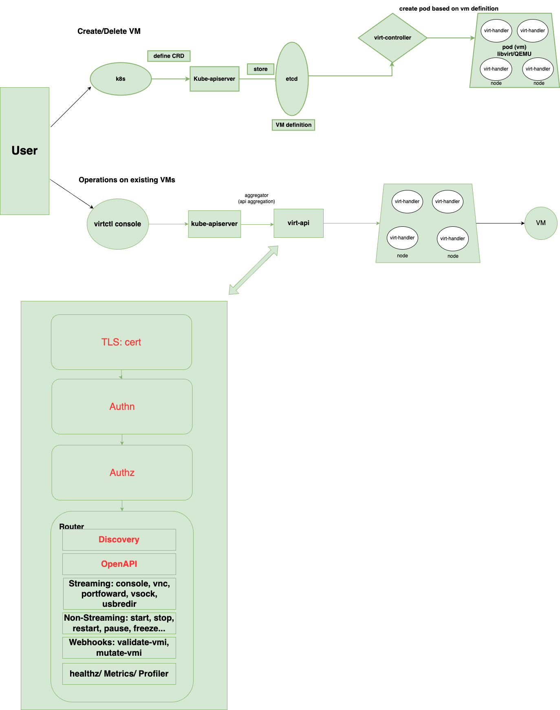
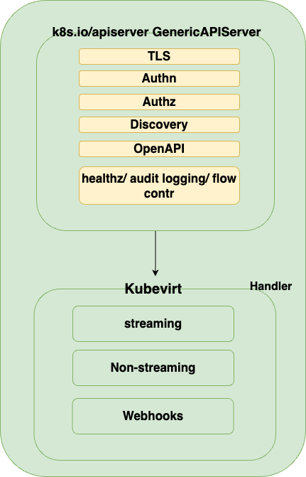

# VEP #NNNN: Your short, descriptive title

## Release Signoff Checklist

Items marked with (R) are required *prior to targeting to a milestone / release*.

- [ ] (R) Enhancement issue created, which links to VEP dir in [kubevirt/enhancements] (not the initial VEP PR)
- [ ] (R) Target version is explicitly mentioned and approved
- [x] (R) Graduation criteria filled

## Overview

<!--
Provide a brief overview of the topic)
-->
Historically, the virt-api component has relied on a custom HTTP server implementation to manually handle TLS, authentication (Authn), authorization (Authz), API discovery, and OpenAPI serving. This VEP proposes migrating virt-api to the k8s.io/apiserver library to leverage the standard Kubernetes API server infrastructure. Adopting this upstream standard will significantly reduce maintenance overhead and enable seamless security updates for the system.

## Motivation

<!--
Why this enhancement is important
-->
- The upstream library already provides all the custom code that handle TLS, Authn/Authz, API discovery, and OpenAPI serving so there is no need to maintain those solely.
- Vulnerability mitigations must be manually tracked and ported. For instance, to address the HTTP/2 Rapid Reset vulnerability(CVE-2023-44487), we had to manually disable HTTP/2 in api.go (ref: line 1118-1119).
- Implementing new features from scratch would require significant effort and time whereas the upstream library supports them natively.

## Goals

<!--
The desired outcome
-->
- Replace virt-api's customized HTTP server implementation with k8s.io/apiserver's GenericAPIServer.
- Maintain all existing functionalities without degradation.
- Deliver a PoC demonstrating websocket streaming(advanced routing) works under GenericAPIServer.


## Non Goals

<!--
Why this enhancement is important Limitations to the scope of the design
-->
- No changes to the external API interface of virt-api.
- No changes to other components such as virt-handler, virt-controller, etc.
- No changes to the CRD storage layer(CRUD ops for VMs/VMIs should still use the kube-apiservers' CRD).

## Definition of Users

<!--
Who is this feature set intended for
-->
- KubeVirt end users for better stability and security.
- KubeVirt developers for better maintenance experience.

## User Stories

<!--
List of user stories this design aims to solve
-->
- As a KubeVirt maintainer, I want virt-api to dynamically support standard Kubernetes API features for better observability.

## Repos

<!--
List of repose this design impacts
-->
https://github.com/kubevirt/kubevirt

## Design

<!--
This should be brief and concise. We want just enough to get the point across
-->
- Current Architecture


- virt-api
    - **TLS Layer**
        - Relies on custom cert management and manual configuration of the tls.Config struct.
    - **Authentication (Authn)**
        - Manually extracts requestheader values and explicitly verifies peer certificates for every incoming request.
    - **Authorization (Authz)**
        - Requires manual URL parsing of SubjectAccessReview objects to validate permissions against the Kubernetes API.
    - **Routing Layer**
        - Fragmented approach with go-restful for standard REST API routing and native net/http handlers for webhooks.

- Proposed Architecture

    

    - Replace the top three layers with GenericAPIServer. The discovery/OpenAPI layer is automatically generated within the Router layer while the business logic handler is mounted as a custom handler.

    - Webhook Strategy
    The current virt-api architecture serves 26 admission webhooks (21 validating, 5 mutating) through `http.HandleFunc` sharing the same TLS server. These webhooks are called by kube-apiserver (not API aggregation) when CRD objects are created or modified.
    
    Three approaches were considered for the implementation:
    1. We can still keep webhooks handlers on the GenericAPIServer's mux, currently we are using the HandleFunc and AdmissionReview req/resp handlers. After migration, they can be mounted on GenericAPIServer.Handler.NonGoRestfulMux with minimal changes which means that all the admitters and mutators will stay unchanged. Webhook req comes from kube-apiserver not API aggregation so they don't have to go through the GenericAPIServer's authn/authz chain.
    
    2. Not suitable. KubeVirt's webhooks intercept CRD operations on kube-apiserver (VM/VMI CRUD), not requests handled by virt-api itself. Admission plugins only apply to requests processed by their own apiserver.

    3. Adds deployment complexity (extra Deployment, extra TLS certificates) and requires duplicating shared dependencies (clusterConfig, informers). Not justified given first method's simplicity.The `ValidatingWebhookConfiguration` and `MutatingWebhookConfiguration` objects registered by virt-operator remain unchanged in all options.

## API Examples

<!--
Tangible API examples used for discussion
-->
- Now
```Go
// resource list and subresources listed
subws.Route(subws.GET("/").To(func(request, response) {
    list := &metav1.APIResourceList{}
    list.APIResources = []metav1.APIResource{
        {Name: "virtualmachineinstances/console", Namespaced: true},
        {Name: "virtualmachineinstances/vnc", Namespaced: true},
        // ... more entries
    }
    response.WriteAsJson(list)
}))
// custom api group list
subws.Route(subws.GET("apis").To(func(request, response) {
    list := &metav1.APIGroupList{}
    list.Groups = append(list.Groups, subresourceAPIGroup())
    response.WriteAsJson(list)
}))
```
```Go
// manually parse URLs to extract resource attributes
pathSplit := strings.Split(req.Request.URL.Path, "/")
// ...
group := pathSplit[2]
version := pathSplit[3]
namespace := pathSplit[5]
resource := pathSplit[6]
resourceName := pathSplit[7]
subresource := pathSplit[8]
// SubjectAccessReview
r.Spec.ResourceAttributes = &authv1.ResourceAttributes{
		Namespace: namespace,
		Verb:      verb,
		Group:     group,
		Version:   version,
		Resource:  resource,
	}
```


- After 
```Go
apiGroupInfo := genericapiserver.NewDefaultAPIGroupInfo(
    "subresources.kubevirt.io", Scheme, metav1.ParameterCodec, Codecs)
s.GenericAPIServer.InstallAPIGroup(&apiGroupInfo)
```

```Go
// No authorization code is required
// RecommendedOptions.ApplyTo() automatically config DelegatingAuthorizer
// Automatically parses resource attributes from URLs, and automatically issues SubjectAccessReviews.
serverConfig := genericapiserver.NewRecommendedConfig(Codecs)
o.RecommendedOptions.ApplyTo(serverConfig)
```

## Alternatives
<!--
Outline any alternative designs that have been considered)
-->
- Consistently maintain the customized HTTP server
- Place a proxy (such as kube-rbac-proxy) in front of the virt-api to handle authn and authz while virt-api itself only processes business requests.
- Use apiserver-builder to generate the extension API server scaffolding instead of manually modifying sample-apiserver.

## Scalability

<!--
Overview of how the design scales)
-->
- Migration will not change the Scalability of virt-api (which continues to use the Deployment + multi-replica pattern). GenericAPIServer incorporates built-in traffic control and request timeout mechanisms, potentially offering superior performance compared to the existing implementation.

## Update/Rollback Compatibility
- No impact on end user side.
- If the new virt-api fails to start, the Deployment rollout will fail, need manual intervention or rollback.
- Migrations does not affect external APIs. It is recommended to control migrations via feature gates to support rollbacks without degradation. If reverting to an older images is necessary, make sure startup parameters and certificate configs remain compatible with the previous version.

<!--
Does this impact update compatibility and how?)
-->


## Functional Testing Approach

<!--
An overview on the approaches used to functional test this design)
-->
- The existing pkg/virt-api/api_test.go and pkg/virt-api/rest/*_test.go files should still pass after migration.
- New integration tests should validate the behavior of discovery and auth/authz under GenericAPIServer.
- During the PoC phase, focus on testing WebSocket connections for streaming subresources.

## Graduation Requirements

<!--
The requirements for graduating to each stage.
Example:
### Alpha
- [ ] Feature gate guards all code changes
- [ ] Initial implementation supporting only X and Y use-cases

### Beta
- [ ] Implementation supports all X use-cases

It is not necessary to have all the requirements for all stages in the initial VEP.
They can be added later as the feature progresses, and there is more clarity towards its future.

Refer to https://github.com/kubevirt/community/blob/main/design-proposals/feature-lifecycle.md#releases for more details
-->

### Alpha
- The GenericAPIServer skeleton should be able to started, and discovery is working.
### Beta
- All subresources migration completed.
- Webhook mounting method determined and implemented.
- All existing tests passed.
### GA
- original code deprecated.
- Feature gate enabled by default.
- At least verified by one beta release.